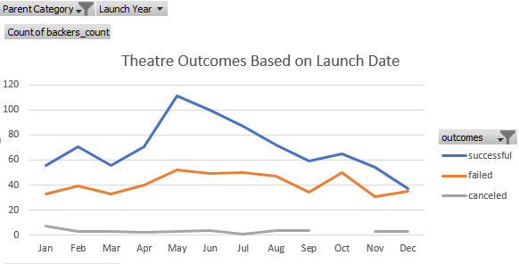
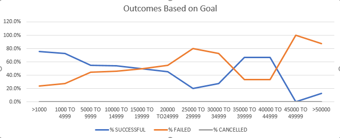

# A Study of Size and Seasonal Effects on Kickstarter Campaign Outcomes

## Overview of Project
This study comprised certain data pertaining to over 4,000 kickstarter campaigns launched between 2009 and 2017. The campaigns in the data set were located in over 20 countries and concerned a wide array of topics and subject matter. The goal amounts of these campaigns ranged from $1 to $100,000,000 USD. Key data in the set included catergocial data relating to the subject of the campaign, the campaigns' monetary targets and oucomes, launch dates and deadlines, place of origin, number of backers, and whether or not the campaign was a staff pick or spotlighted on the kickstarter website. Overall, the panel of data is complete with no matieral omissions of data in the set. Given the size and completeness of the data set, statistical inference across the set would be strong and relationships among the data should be able to be extrapolated to future campaign launches. 

## Purpose
The purpose of this analysis is to investigate trends and relationships in the underlying data to identify factors that can materially effect outcomes of  kickstarter campaigns in the data set. Specifically, this analysis investigated the efffects of the size of the monetary goal and the date on which the campaign was launched and their impact on the ultimate success or failure of those campaings. These relationships can then be used to maximize the probability of success of a future launch of a campaign in the theater space which is the ultimate objective of this analysis. 

## Analysis and Challenge

### Analysis of Outcomes Based on Launch Date

### Analysis of Outcomes Based on Goals

### Challenges and Difficulties Encountered
#### Although the data set was mostly complete, several manipulations of the raw data were undertaken to facilitate this analysis. 
- The set contained dates upon which the project was launched upon when it was completed. In order to study seasonal trends, it was neccessary to extract the year and the month from the raw data which was then organized into a PivotTable filtered for theater projects. From the Pviottable, we were able to create a visualization of the data using a line chart.

- The set also contained data for the goal amount of the campaign and the amount that cmmpaign raised. A new variable representing the success or failure of the campaign was created to allow us to categorize the campaigns as either a success, failure, or cancellation which was much more pertinent to the anlaysis.

- In order to better study the size and its effect on campaign outcomes, the count of successful, failed, and canceled campaigns was organized into tranches ranging from less than $1,0000 USD to greater than $50,000 USD using increments of $5,000 USD. Three variables denoting the percentage of the counts of successful, failed, and canceled campaigns in each tranche were also created and added to the set. These manipulations allowed for a presentation of the data in a line chart.

## Results

### Outcomes Based on Launch Date
The data set contained a low number of canceled outcomes that did not bear any apparent relationship to the date upon which those campaigns were launched. Though both failed and successful campaigns counts tended to be relatively higher from May through August, this trend is much more pronounced among the count of successful campaigns. The lowest counts of campaigns for both failed and successful campaigns occurred in the winter months of November, December, and January. The exception to this trend would be the month of March where the count of failed and successful campaigns decreased from the previouys month before resuming an increase in April. 

### Outcomes Based on Goal
As with outcomes based on launch date, there are not enough observations of cancelled campaigns in the set to draw any conculsions other than that it is a relatively rare event for a campagin to be cancelled before its deadline. For campaigns <$1,000 to $29,999 USD, there is an evident trend in the set indicating that there is an inverse relationship between the size of the campaign and its liklihood of success. Both the percent of successful and failed campaigns relative to the total number of campaigns indicate a linear relationship to size. As is evident in the above figure, this relationship tends to break down for campaigns $30,000 USD and above. However, with this set, it is not possible to draw any conclusions regarding the breakdown of this relationship as there are simply not enough observations to be able to draw valid statistical inference. Indeed only 3.5% of the data occurs in these size tranches and no decisions should be based upon this data. Converesely, one CAN infer from the set at large that kickstarter campaigns are used to fund relatively smaller projects and that this method of funding would not be best for larger projects. In fact, maximizing success for projects with captial requirements above this threshold would rather entail the pursit of access to more tratitional sources of captial such as bank loans as opposed to crowdfunding on the kickstarter platform. 

## Limitations
- As previously mentioned, the observations are not evenly distributed when considering the set within the context of size. Approximately 85% of the observations are for campaigns with funding goals lower than $9,999 USD. Therefore, this set is of limited use for larger campaigns.
- Most importantly, the observations in this set are from 2009-2017 and not contiguous with the present point in time. Any material changes to the crowdfunding or theatre industry after 2017 would not be reflected in the data. Such items could include increased regulation or competion from other platforms. The primary development would be the COVID pandemic and its impact on the theatre industry which could materially change the relationships between the data in this set. 

## Further Analysis
- The duration of the campaign and its effect on the ultimate outcome of the campaign was not studied. This variable could be extracted from the raw data and visualized using a line chart similar to the one used to study the effect of goal size. 
-  Designation of a campaign as a staff favorite or a spotlghted campaign would also be an import vairable for further analysis. A study of the percent of successful campaigns with this designation would be of particular interest. 
-  The count of types of outcomes by launch date is somewhat inseperable from the popularity of when campaigns were launched. A more appropriate analysis would be to use outcome type as a percentage of the total cmapaigns for that period giving more insight as to the probability of success. 
---
# Kickstarter Outcomes Dataset - [Kickstarter_Outcomes_Data](Kickstarter_Challenge.xlsx)

