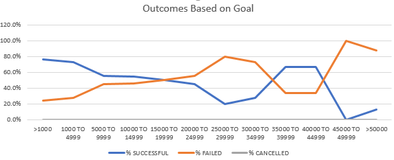

# A Study of Size and Seasonal Effects on Kickstarter Campaign Outcomes

## Overview of Project
This study comprised certain data pertaining to over 4,000 kickstarter campaigns launched between 2009 and 2017. The campaigns in the data set were located in over 20 countries and concerned a wide array of topics and subject matter. The goal amounts of these campaigns ranged from $1 to $100,000,000 USD. Key data in the set included catergocial data relating to the subject of the campaign, the campaigns' monetary targets and oucomes, launch dates and deadlines, place of origin, number of backers, and whether or not the campaign was a staff pick or spotlighted on the kickstarter website. Overall, the panel of data is complete with no matieral omissions of data in the set. Given the size and completeness of the data set, statistical inference across the set would be strong and relationships among the data should be able to be extrapolated to future campaign launches. 

### Purpose
The purpose of this analysis is to investigate trends and relationships in the underlying data to identify factors that have materially affected outcomes of the kickstarter campaigns in the data set. Specifically, this analysis investigated the efffects of the size of the monetary goal and the date on which the campaign was launched and their impact on the ultimate success or failure of those campaings. 

## Analysis and Challenge

### Analysis of Outcomes Based on Launch Date

### Analysis of Outcomes Based on Goals

### Challenges and Difficulties Encountered
#### Although the data set was mostly complete, several manipulations of the raw data were undertaken to facilitate this analysis. 
- The set contained dates upon which the project was launched upon when it was completed. In order to study seasonal trends, it was neccessary to extract the year and the month from the raw data which was then organized into a PivotTable. From the Pviottable, we were able to create a visualization of the data using a line chart.

- The set also contained data for the goal amount of the campaign and the amount that cmmpaign raised. A new variable representing the success or failure of the campaign was created to allow us to categorize the campaigns as either a success, failure, or cancellation which was much more pertinent to the anlaysis.

- In order to better study the size and its effect on campaign outcomes, the count of successful, failed, and canceled campaigns was organized into tranches ranging from less than $1,0000 USD to greater than $50,000 USD using increments of $5,000 USD. Three variables denoting the percentage of the counts of successful, failed, can canceled campaigns in each tranche were also created and added to the set. These manipulations allowed for a presentation of the data in a line chart.

## Results

### Outcomes Based on Launch Date
The data set contained a low number of canceled outcomes that did not bear any apparent relationship to the date upon which those campaigns were launched. Though both failed and successful campaigns counts tended to be relatively higher from May through August, this trend is much more pronounced among the count of successful campaigns. The lowest counts of campaigns for both failed and successful campaigns occurred in the winter months of November, December, and January. The exception to this trend would be the month of March where the count of failed and successful campaigns decreased from the previouys month before resuming an increase in April. 

- What can you conclude about the Outcomes based on Goals?

- What are some limitations of this dataset?

- What are some other possible tables and/or graphs that we could create?
